<h1 align="center">
  
  <br/>
  Twitch Clone UI
</h1>

## 🎥 Gifs

<p align="center">
  
  
  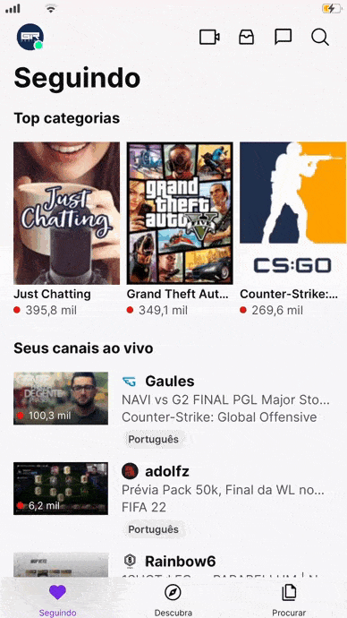
</p>

<p align="center" style="margin-top:16px">
  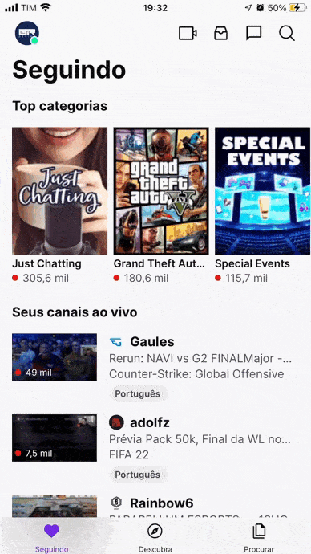
  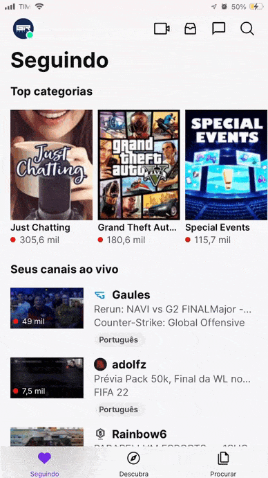
  
</p>

<p align="center" style="margin-top:16px">
  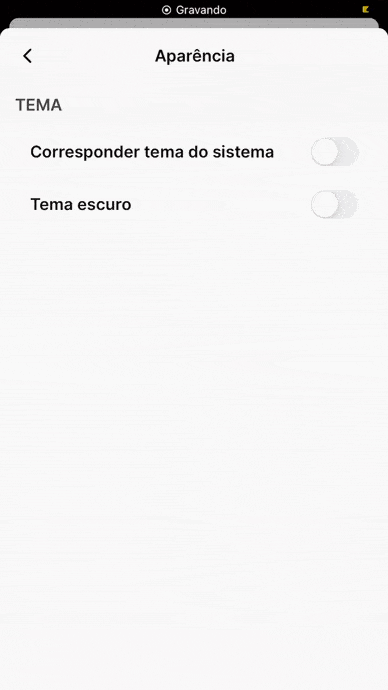
</p>
<br/>

## 📸 Imagens
<p align="center">
  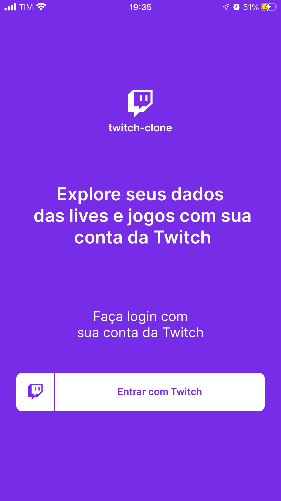
  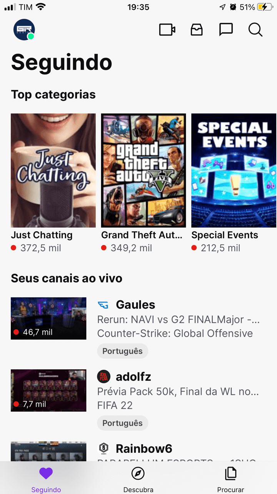
  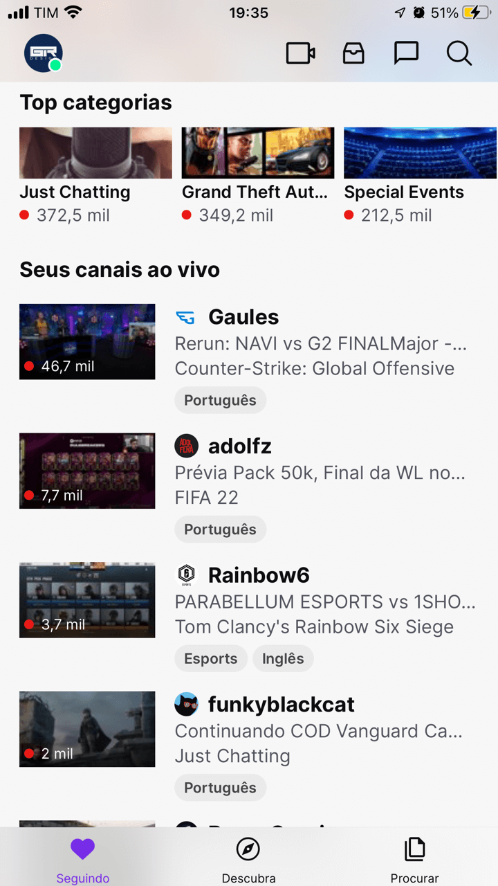
</p>

<p align="center" style="margin-top:16px">
  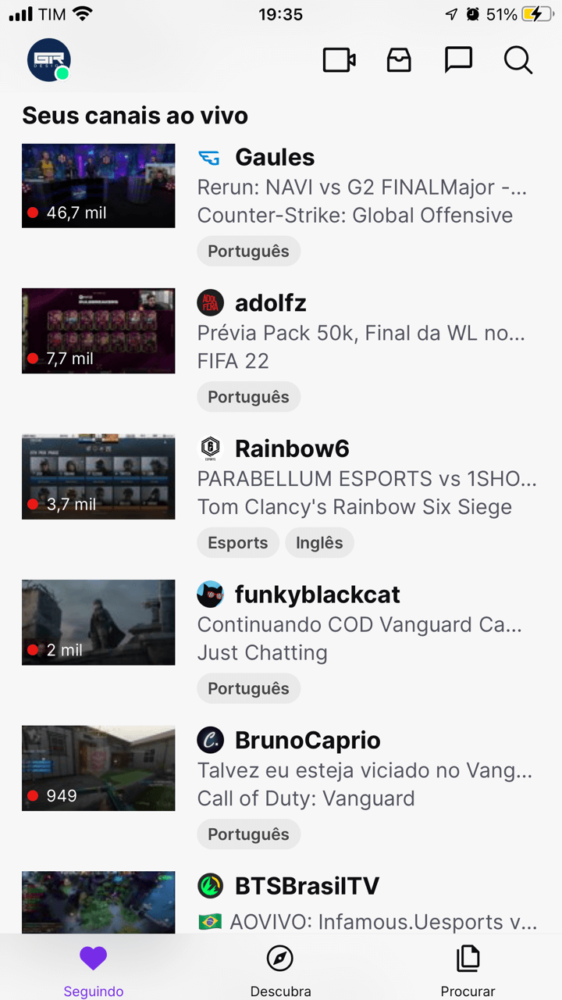
  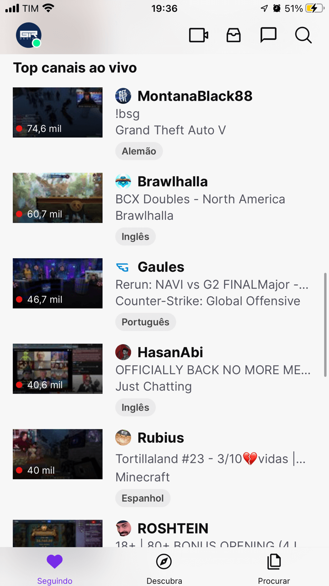
  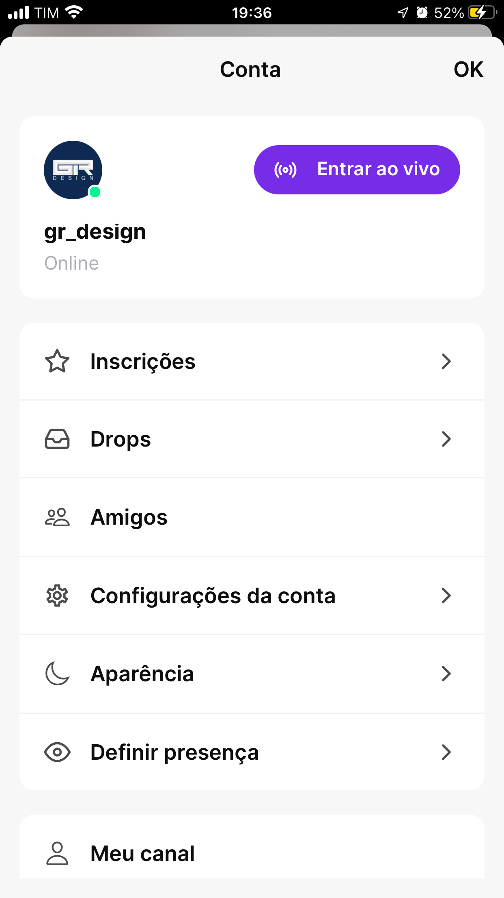
</p>

<p align="center" style="margin-top:16px">
  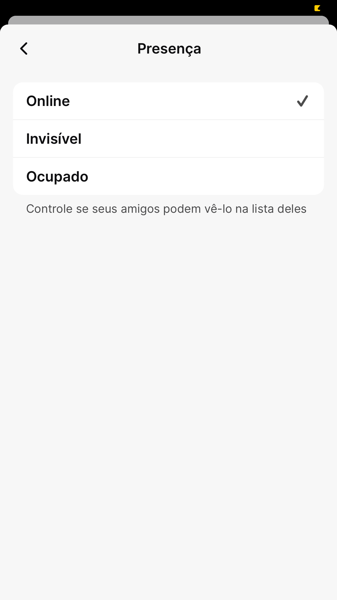
  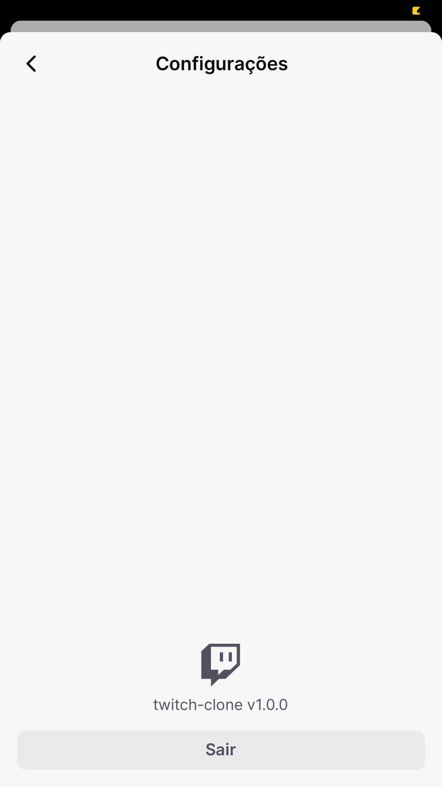
  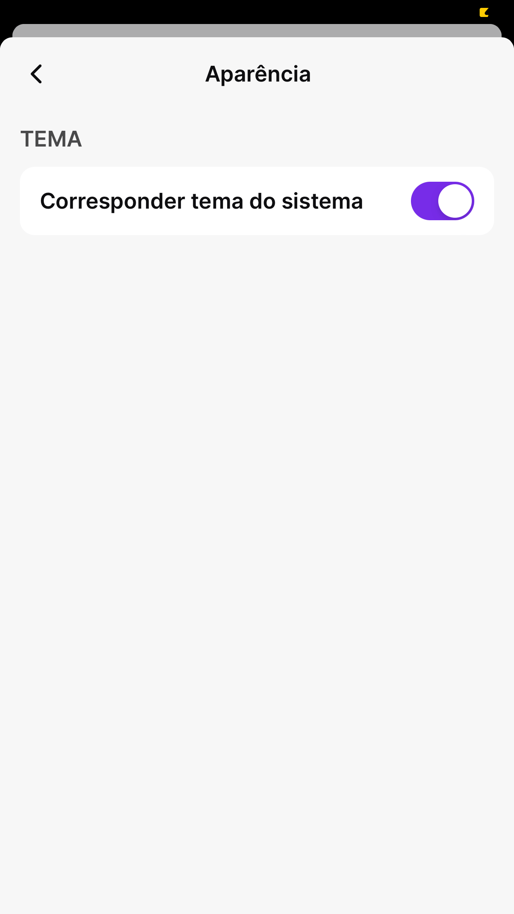
</p>

<p align="center" style="margin-top:16px">
  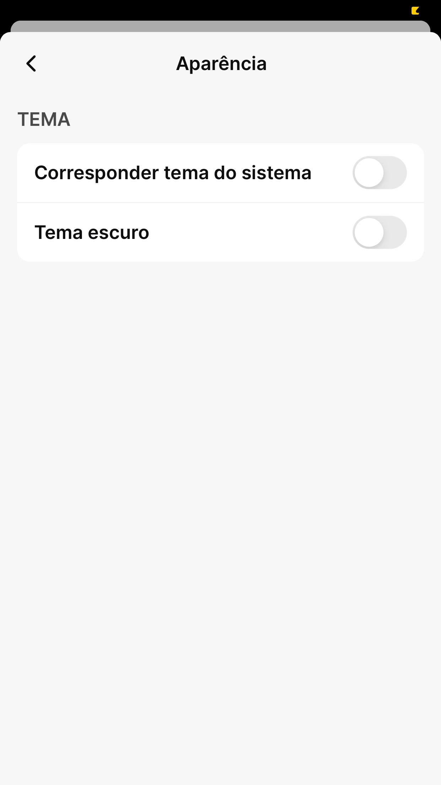
  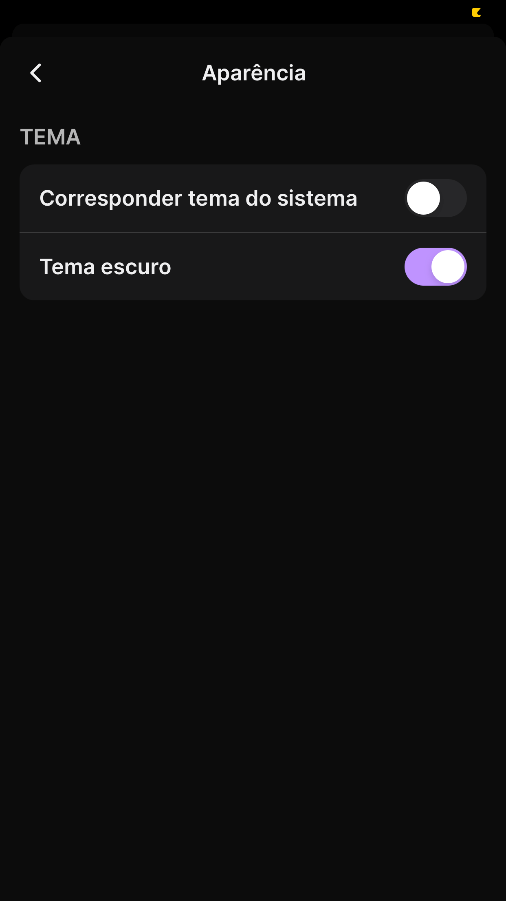
  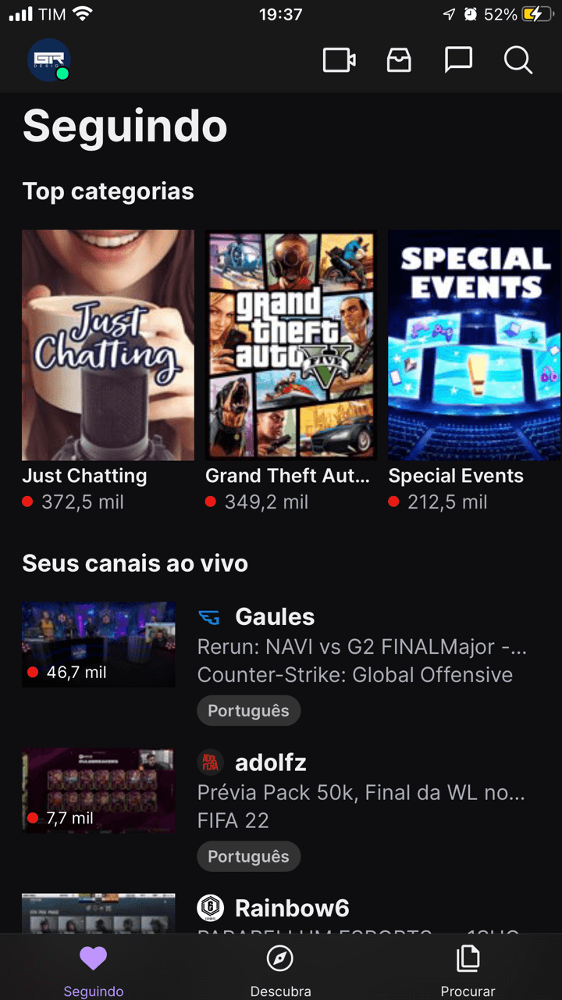
</p>
<br/>

## 💻 Projeto

Clone da interface do aplicativo Twitch, para esse projeto foi utilizado o conceito de **Atomic Design** para o desenvolvimento dos componentes e os commits foram realizados utilizando o padrão de **Conventional Commits**.

## 🎯 Objetivos

O objetivo principal do projeto foi a utilização de alguns pacotes específicos com o intuito de aprender como utilizá-los e aumentar o leque de conhecimento/possibilidades.

## 🖥️ Telas 

- [x] Login (customizada)
- [x] Seguindo
  - [x] Top categorias
  - [x] Seus canais ao vivo
  - [x] Top canais ao vivo
- [ ] Descubra
- [ ] Procurar
- [ ] Perfil
  - [ ] Inscrições
  - [ ] Drops
  - [ ] Amigos
  - [x] Configurações da conta
  - [x] Aparência
  - [x] Definir presença
  - [ ] Meu canal
  - [ ] Gerenciamento de transmissão

## ✨ Tecnologias
- React Native
- Typescript
- Expo
- React Navigation Native
- React Navigation Bottom Tabs
- React Navigation Stack
- Expo Auth Session
- Axios
- Babel Plugin Inline Dotenv
- Expo Blur
- Expo Linear Gradient
- Expo Constants
- RN Placeholder 
- Async Storage
- Styled Components
- React Native Iphone X Helper
- React Native Size Matters
- React Native Vector Icons
- Expo Font
- Expo Google Fonts
- Eslint
- Prettier

## 🔖 Layout

O layout seguido foi baseado no aplicativo para iOS da Twitch, então por esse motivo os valores de tamanhos e espaçamentos são aproximados. A tela inicial de login foi customizada e não segue a tela original do app.

## 🤔 Observações

- O projeto foi desenvolvido utilizando o Expo Bare Workflow e adicionado o TypeScript logo em seguida, utilizando esse "modo" de desenvolvimento é possível que no futuro seja adicionado bibliotecas que não sejam compatíveis com o Expo, além da disponibilização das pastas `android` e `ios`, fazendo com que seja possível aplicar configurações personalizadas para a aplicação; 
- A ideia principal desse projeto era implementar o login social através do login via Twitch utilizando o Expo Auth Session;
- Para buscar os dados da tela **Seguindo** para as seções: **Top categorias**, **Seus canais ao vivo** e **Top canais ao vivo**, foi utilizado a própria api disponibilizada pela Twitch;
- Para trabalhar com variáveis de ambiente (arquivos do tipo: `.env`), foi utilizado a biblioteca Babel Plugin Inline Dotenv;
- Para armazenar o token do usuário logado na aplicação de forma mais segura utilizando encriptação, foi utilizado a biblioteca Expo Secure Store;
- No projeto existem dois tipos de navegação: *Bottom Tabs* e *Stack*. Há também as rotas públicas para quando o usuário não está logado e as rotas privadas para quando ele já se autenticou. As telas que fazem parte do módulo de **Perfil** são do tipo de navegação *Stack* porém no formato de *modal*;
- Na tela de **Presença**, o usuário pode definir seu status, escolhendo uma das 3 opções disponíveis ("Online", "Invisível" e "Ocupado"). Essa alteração será refletida para todos os locais que utilizam essa informação, que por sua vez fica armazenada tanto no contexto da aplicação como no async storage junto com as outras informações do usuário;
- A aplicação posssui a funcionalidade de troca de tema através da tela de **Aparência**. Nessa tela, é possível selecionar para que a aplicação utilize o tema do sistema ou escolher entre os temas "Claro" e "Escuro" manualmente. Essa informação também ficará armazenada no contexto da aplicação e no async storage;
- A biblioteca Expo Constants foi utilizada para acessar as informações presentes no arquivo `app.json` (por exemplo: nome e versão da aplicação);
- Para demonstrar que há um conteúdo sendo carregado de forma visual, foi utilizado a biblioteca RN Placeholder;
- O efeito de *"blur"* presente tanto no componente de *Header* da tela de **Seguindo** e no componente de navegação customizado *Bottom Tabs*, foi criado utilizando a biblioteca Expo Blur;
- Para os ícones da aplicação foi utilizada a biblioteca React Native Vector Icons;
- Pensando na responsividade, densidade de pixel e diferentes tamanhos de telas de dispositivos distintos, foi utilizada a biblioteca React Native Size Matters que permite lidar com essas situações;
- Para lidar com dispositivos com Notch foi utilizado a biblioteca React Native Iphone X Helper;
- O visual de gradiente presente no card da stream (transparente para preto) foi possível utilizando a biblioteca Expo Linear Gradient;
- A estilização dos componentes foi feita utilizando o Styled Components, com um arquivo de tema e propriedades padrões que permitem centralizar configurações de estilo gerais da aplicação, dessa forma a manutenção e a troca de estilos se torna muito mais simples;

## ⌨️ Executando o projeto

Utilize um dos seguintes comandos para instalar as dependências do projeto:

```cl
yarn
```
```cl
npm install
```

Em seguida, utilize o seguinte comando para iniciar o projeto:

```cl
expo start
```

Após isso, é possível executar o projeto em um dispositivo físico real (necessário possuir o Expo Go instalado) escaneando o QR Code. Outra opção é executar o projeto em um simulador (Android ou iOS), digitando no *console* ou escolhendo a opção na aba aberta do Expo no browser.